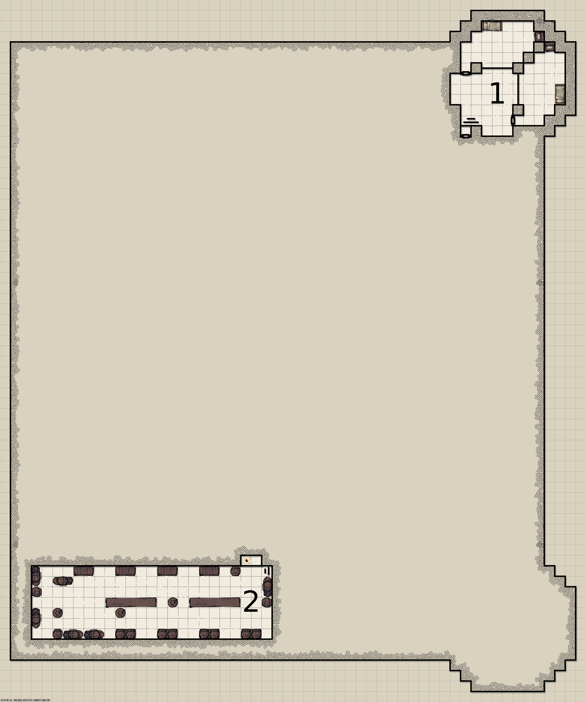
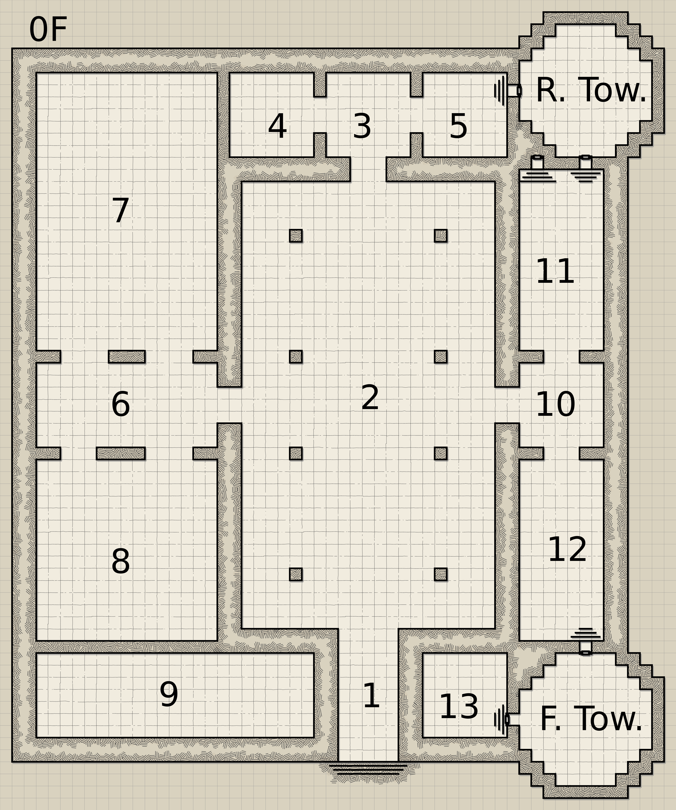
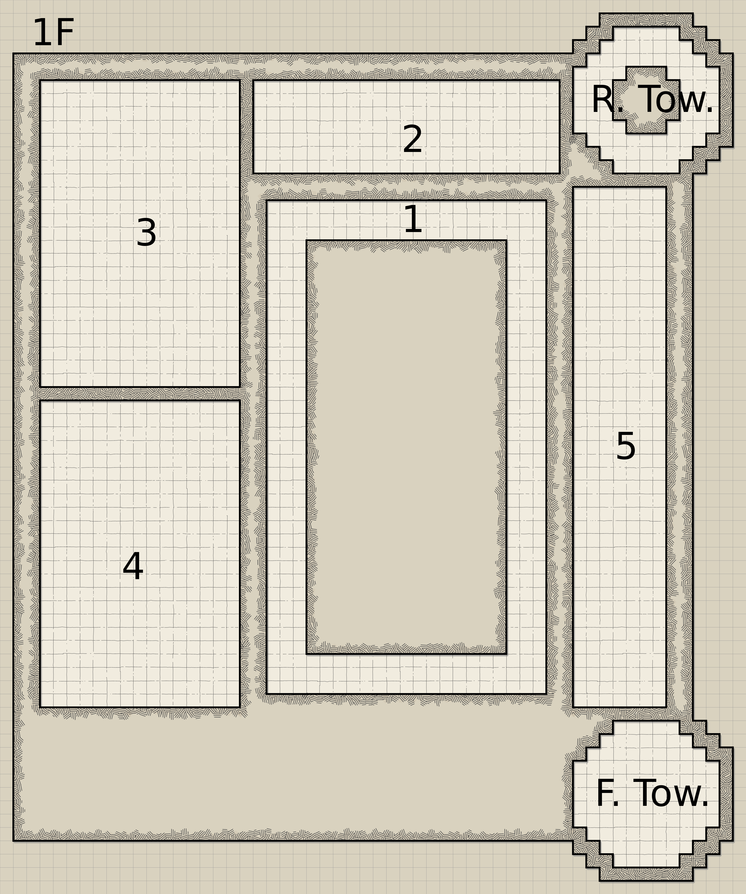
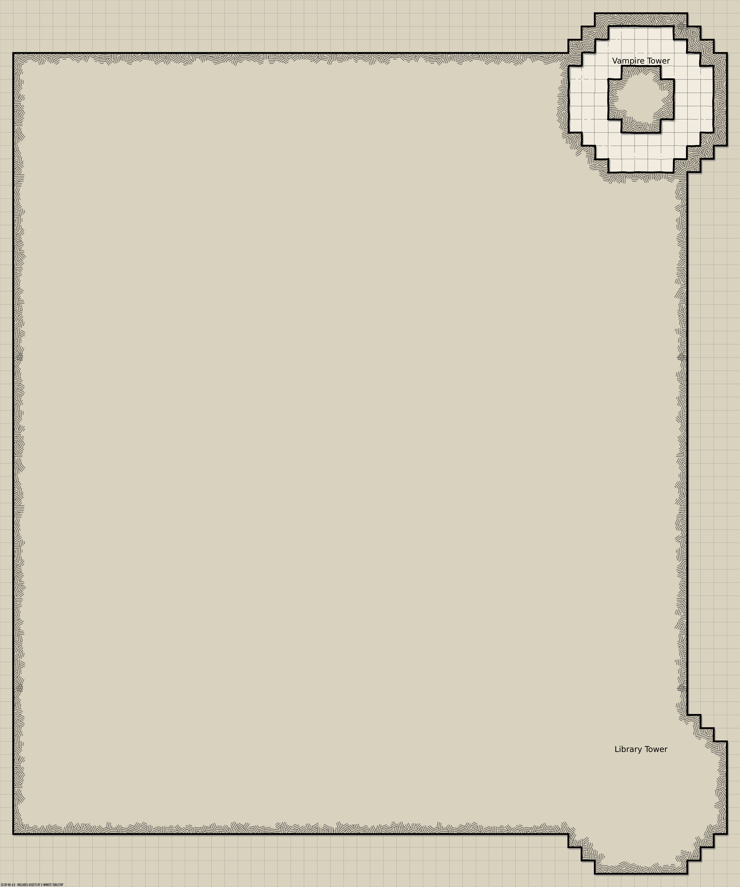

# Nyeogmi Manor 

## Server
Currently hosted at `krutonium.ga` (whitelisted). Schematic will become available soonish.

## Floorplan
See [Floorplan](floorplan).
`Nyeogmi_Manor.ds` can be loaded with [Dungeon Scrawler](https://probabletrain.itch.io/dungeon-scrawl) for editing.
### -1F

1. Gaol
2. Cellar
---
### 0F (Ground Floor)

1. Main Entry
2. Courtyard
3. Public study 1
4. Public bathroom 1
5. Public pantry
6. Dining entry
7. Lounge (Contains a bulletin board for thrall orders)
8. Dining
9. Kitchen
10. pantry
11. Public study 2
12. Armory
13. Smithy
14. Private Study
---
### 1F

1. Canopy
2. ? (Can this be converted to bedroom space? Perhaps consider a low-light connection from the R. Tower to the lounge.)
3. Lounge, upper level/mezzanine. (Consider a staircase connecting them?)
4. Upstairs dormitory
5. Bedroom 1
6. Bedroom 2
7. Bedroom 3
8. Gallery
---
### 2F

1. Roost. (Provide unlit crawl-space, suitable for vampires. Ideally this should be accessible from the main bedroom while avoiding sunlight)
---
### 3F

---
### Front Tower
Library - 3 floors (0-2)
### Rear Tower
Nyeogmi Tower - 4 floors (0-3)
